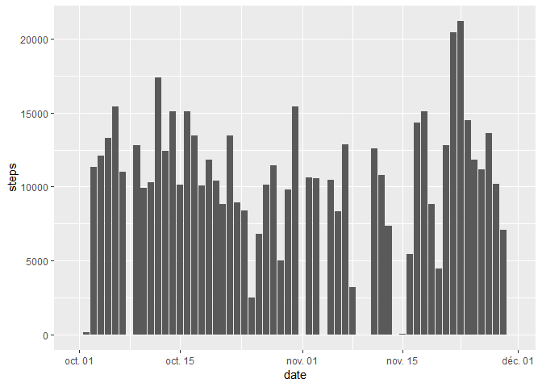
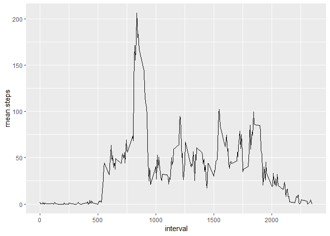
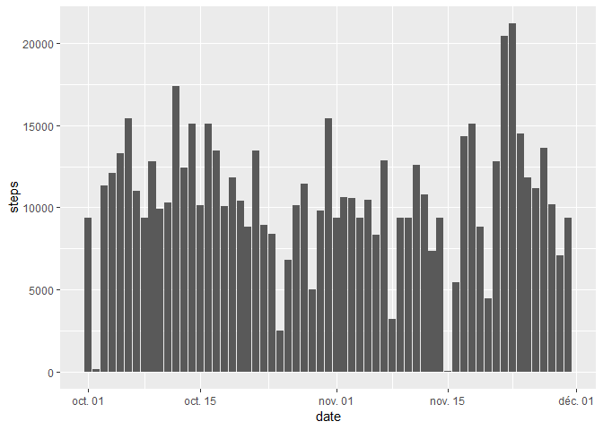

This assignment makes use of data from a personal activity monitoring device. This device collects data at 5 minute intervals through out the day. The data consists of two months of data from an anonymous individual collected during the months of October and November, 2012 and include the number of steps taken in 5 minute intervals each day.

## Loading and preprocessing the data


```r
knitr::opts_chunk$set(echo = TRUE)
```

```r
library(lubridate)
```

```
## 
## Attaching package: 'lubridate'
```

```
## The following object is masked from 'package:base':
## 
##     date
```

```r
library(ggplot2)
```

```
## Registered S3 methods overwritten by 'ggplot2':
##   method         from 
##   [.quosures     rlang
##   c.quosures     rlang
##   print.quosures rlang
```

```r
activ <- read.csv("./activity.csv")
activ$date <- ymd(activ$date)
```

At first sight, we see that we have missing values (NA) in our data. Let's first explore the data as it is before dealing with missing values.

## What is mean total number of steps taken per day?

Let's first aggregate the number of steps for each day and plot it in a histogram.


```r
sum_steps <- aggregate(activ$steps,list(activ$date), sum, na.rm = TRUE)
colnames(sum_steps) <- c("date", "steps")
ggplot(data = sum_steps, aes(x= date, y = steps)) + geom_col()
```

<!-- -->


```r
mean.day <- round(mean(sum_steps$steps))
median.day <- median(sum_steps$steps)
print(mean.day)
```

```
## [1] 9354
```

```r
print(median.day)
```

```
## [1] 10395
```

On average, the subject has taken a total of 9354 steps per day during the period. The median is 10395 total steps per day.

## What is the average daily activity pattern?  


```r
by5min <- aggregate(activ$steps,list(activ$interval), mean, na.rm = TRUE)
colnames(by5min) <- c("interval", "mean.steps")
ggplot(data = by5min, aes(x = interval,y = mean.steps))+geom_line()
```

<!-- -->


```r
max.steps <- max(by5min$mean.steps)
top.interval <- by5min$interval[which(by5min$mean.steps == max.steps)]
top.hour <- floor(top.interval/100)
top.minute <- top.interval%%100
endtop.hour <- floor((top.interval+5)/100)
endtop.minute <- (top.interval+5)%%100
```

According to the experience, the subject has a peak time in the interval from 8h35 to 8h40.
The average number of steps from the user during this interval is 206.

## Imputing missing values  

Let's address the missing values. 


```r
nbna <- sum(is.na(activ$steps))
##activ_clean <- subset(activ, !is.na(activ$steps))

mean.interval <- mean.day/(288)
activ2 <- activ
activ2$steps[which(is.na(activ2$steps))] <- mean.interval
```

1. In the original data, 2304 intervals have missing values (coded as \color{red}{\verb|NA|}NA).
2. Let's replace those NAs with the daily mean calculated earlier. To do so, let's divide the mean.day by the number of intervals in one day (288). The result is an interval mean of 32.48 steps per interval.
3. A new dataset "activ2" without missing values is created.


```r
sum_steps2 <- aggregate(activ2$steps,list(activ2$date), sum, na.rm = TRUE)
colnames(sum_steps2) <- c("date", "steps")
ggplot(data = sum_steps2, aes(x= date, y = steps)) + geom_col()
```

<!-- -->

```r
mean.day.new <- round(mean(sum_steps2$steps))
median.day.new <- median(sum_steps2$steps)
print(mean.day.new)
```

```
## [1] 10581
```

```r
print(median.day.new)
```

```
## [1] 10395
```
4. Based on this new dataset, the mean number of steps per day is 10581. Compared with the initial value, the mean has increased. However, the median value hasn't changed at 10395.

## Are there differences in activity patterns between weekdays and weekends?

A new factor variable "weekday" is introduced, with 2 levels : "weekday" and "weekend". By default, let's assign the value "weekday" to all rows. Then, we identify the position of the saturdays ("samedi") and sundays ("dimanche") and we assign the value "weekend" to these rows.


```r
activ2 <- cbind(activ2, as.factor(rep("weekdays",length(activ2$date))))
colnames(activ2)=c("steps", "date", "interval", "weekday")
levels(activ2$weekday) = c("weekday", "weekend")
weekends <- which(weekdays(activ2$date)==("samedi")|weekdays(activ2$date)==("dimanche"))
activ2$weekday[weekends] <- as.factor("weekend")
table(activ2$weekday)
```

```
## 
## weekday weekend 
##   12960    4608
```


```r
by5min <- aggregate(activ2$steps,list(activ2$interval, activ2$weekday), mean)
colnames(by5min) <- c("interval", "weekday","mean.steps")
ggplot(data = by5min, aes(x = interval,y = mean.steps)) + geom_line() + facet_grid(weekday~.)
```

<!-- -->

We can notice differences in the subject's activity depending on the day of the week. During the weekdays, activity peaks in the morning and then remains at a lower level during much of the day. By contrast, activity starts later during the weekends and then remains steady during the day until the evening. 

Thanks for the review !
